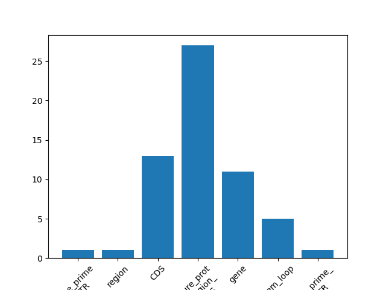

# Comandos de la Práctica 01
**Daniel Villegas Aguilar**

## Parte I. 

**Respuesta 1:** Creación de directorios y archivos.

Comandos:

```
[dan@daniel Escritorio]$ mkdir GenomicaComputacional
[dan@daniel Escritorio]$ cd GenomicaComputacional/
[dan@daniel GenomicaComputacional]$ mkdir dvillegas_p03
[dan@daniel GenomicaComputacional]$ cd dvillegas_p03/
[dan@daniel dvillegas_p03]$ ls
[dan@daniel dvillegas_p03]$ 
[dan@daniel dvillegas_p03]$ touch comandos_p03.md
[dan@daniel dvillegas_p03]$ ls
comandos_p03.md
[dan@daniel dvillegas_p03]$ 
```


**Respuesta 2:** Tipo de shell.

Comando:
```
[dan@daniel dvillegas_p03]$ echo $0
```

Output: 
```
/bin/bash
```

**Respuesta 3:** Creación de directorios para proyecto bioinformático.

Comandos:
```
[dan@daniel dvillegas_p03]$ mkdir -p {data/{filtered/,raw_data/},meta/,scripts/,figures/,archive/}
[dan@daniel dvillegas_p03]$ ls
archive comandos_p03.md  data  figures  meta  scripts
[dan@daniel dvillegas_p03]$ ls data/
filtered  raw_data
[dan@daniel dvillegas_p03]$
```

**Respuesta 4:**

Es la estructura de un proyecto de investigación en bioinformática (realmente es aplicable a cualquier diciplina científica que se valga de computadoras). 

De esta manera tenemos una forma organizada de dividir dodne tenemos guarada nustra información principal (ya sea cruda o preprocesada), un diccionario de datos para saber que contiene cada archivo, los scrits en sí que procesaen o analicen y un catalogo histórico de lo que se ha realizado hasta el moemnto.

## Parte II.
**Respuesta 1:**
```
dan@daniel dvillegas_p03]$ which bash
/usr/bin/bash
[dan@daniel dvillegas_p03]$ cd scripts/
[dan@daniel scripts]$ vi delay.sh
[dan@daniel scripts]$ cat delay.sh 
/usr/bin/bash
echo "Después de la Parte I. necesito un descanso de exactamente 30 segundos."
[dan@daniel scripts]$ 
```

**Respuesta 2:**
```
[dan@daniel scripts]$ ls -l
total 4
-rw-r--r-- 1 dan dan 94 dic  6 14:04 delay.sh
[dan@daniel scripts]$ chmod 777 delay.sh 
[dan@daniel scripts]$ 
```

**Respuesta 3:**
```
[dan@daniel scripts]$ ls -l
total 4
-rwxrwxrwx 1 dan dan 94 dic  6 14:04 delay.sh
[dan@daniel scripts]$ 
```

**Respuesta 4:**
```
[dan@daniel scripts]$ vi delay.sh
[dan@daniel scripts]$ cat delay.sh 
#!/usr/bin/bash
echo "Después de la Parte I. necesito un descanso de exactamente 30 segundos."
sleep 30
echo "Ya puedo continuar!"
[dan@daniel scripts]$ 
```

**Respuesta 5:**
```
[dan@daniel scripts]$ cat delay.sh 
#!/usr/bin/bash
echo "Después de la Parte I. necesito un descanso de exactamente 30 segundos."
sleep 300
echo "Ya puedo continuar!"

[dan@daniel scripts]$ sh delay.sh &
[6] 5259
[dan@daniel scripts]$ ps -aux | grep delay.sh 
dan         5259  0.0  0.0   9800  2952 pts/3    T    14:43   0:00 sh delay.sh
[dan@daniel scripts]$ kill -9 5259
```

## Parte III.
**Respuesta 1:**
Revisar el archivo en /GenomicaComputacional/dvillegas_p03/meta

**Respuesta 2:**
```
dan@daniel dvillegas_p03]$ mv -t ./data/raw_data/ ~/Descargas/SRR10971381_R1.fastq.gz ~/Descargas/SRR10971381_R2.fastq.gz ~/Descargas/sarscov2_genome.fasta ~/Descargas/sarscov2_genome.gff3 ~/Descargas/sarscov2_assembly.fasta.gz ~/Descargas/splike_a.fasta ~/Descargas/splike_b.fasta ~/Descargas/splike_c.fasta 
[dan@daniel dvillegas_p03]$ ls
comandos_p03.md  data  figures  meta  scripts
[dan@daniel dvillegas_p03]$ ls data/raw_data/
sarscov2_assembly.fasta.gz  splike_a.fasta  SRR10971381_R1.fastq.gz
sarscov2_genome.fasta       splike_b.fasta  SRR10971381_R2.fastq.gz
sarscov2_genome.gff3        splike_c.fasta
[dan@daniel dvillegas_p03]$ 
```

## Parte IV.

**Respuesta 1:**
```
[dan@daniel dvillegas_p03]$ cd data/filtered/
[dan@daniel filtered]$ ln -s ../raw_data/splike_a.fasta
[dan@daniel filtered]$ ls
splike_a.fasta
[dan@daniel filtered]$ ln -s ../raw_data/splike_b.fasta
[dan@daniel filtered]$ ln -s ../raw_data/splike_c.fasta
[dan@daniel filtered]$ ls
splike_a.fasta  splike_b.fasta  splike_c.fasta
[dan@daniel filtered]$ 
```

**Respuesta 2:**
```
[dan@daniel filtered]$ touch glycoproteins.faa
```

**Respuesta 3:**
```
[dan@daniel filtered]$ head -n 1 splike_a.fasta 
>pdb|6VXX|A Chain A, Spike glycoprotein
[dan@daniel filtered]$ head -n 1 splike_b.fasta 
>pdb|6VXX|B Chain B, Spike glycoprotein
[dan@daniel filtered]$ head -n 1 splike_c.fasta 
>pdb|6VXX|C Chain C, Spike glycoprotein
```

**Respuesta 4:**
```
[dan@daniel filtered]$ cat *splike_* > glycoproteins.faa 
[dan@daniel filtered]$ cat glycoproteins.faa 
>pdb|6VXX|A Chain A, Spike glycoprotein
MGILPSPGMPALLSLVSLLSVLLMGCVAETGTQCVNLTTRTQLPPAYTNSFTRGVYYPDKVFRSSVLHST
QDLFLPFFSNVTWFHAIHVSGTNGTKRFDNPVLPFNDGVYFASTEKSNIIRGWIFGTTLDSKTQSLLIVN
NATNVVIKVCEFQFCNDPFLGVYYHKNNKSWMESEFRVYSSANNCTFEYVSQPFLMDLEGKQGNFKNLRE
FVFKNIDGYFKIYSKHTPINLVRDLPQGFSALEPLVDLPIGINITRFQTLLALHRSYLTPGDSSSGWTAG
AAAYYVGYLQPRTFLLKYNENGTITDAVDCALDPLSETKCTLKSFTVEKGIYQTSNFRVQPTESIVRFPN
ITNLCPFGEVFNATRFASVYAWNRKRISNCVADYSVLYNSASFSTFKCYGVSPTKLNDLCFTNVYADSFV
IRGDEVRQIAPGQTGKIADYNYKLPDDFTGCVIAWNSNNLDSKVGGNYNYLYRLFRKSNLKPFERDISTE
IYQAGSTPCNGVEGFNCYFPLQSYGFQPTNGVGYQPYRVVVLSFELLHAPATVCGPKKSTNLVKNKCVNF
NFNGLTGTGVLTESNKKFLPFQQFGRDIADTTDAVRDPQTLEILDITPCSFGGVSVITPGTNTSNQVAVL
YQDVNCTEVPVAIHADQLTPTWRVYSTGSNVFQTRAGCLIGAEHVNNSYECDIPIGAGICASYQTQTNSP
SGAGSVASQSIIAYTMSLGAENSVAYSNNSIAIPTNFTISVTTEILPVSMTKTSVDCTMYICGDSTECSN
LLLQYGSFCTQLNRALTGIAVEQDKNTQEVFAQVKQIYKTPPIKDFGGFNFSQILPDPSKPSKRSFIEDL
LFNKVTLADAGFIKQYGDCLGDIAARDLICAQKFNGLTVLPPLLTDEMIAQYTSALLAGTITSGWTFGAG
AALQIPFAMQMAYRFNGIGVTQNVLYENQKLIANQFNSAIGKIQDSLSSTASALGKLQDVVNQNAQALNT
LVKQLSSNFGAISSVLNDILSRLDPPEAEVQIDRLITGRLQSLQTYVTQQLIRAAEIRASANLAATKMSE
CVLGQSKRVDFCGKGYHLMSFPQSAPHGVVFLHVTYVPAQEKNFTTAPAICHDGKAHFPREGVFVSNGTH
WFVTQRNFYEPQIITTDNTFVSGNCDVVIGIVNNTVYDPLQPELDSFKEELDKYFKNHTSPDVDLGDISG
INASVVNIQKEIDRLNEVAKNLNESLIDLQELGKYEQYIKGSGRENLYFQGGGGSGYIPEAPRDGQAYVR
KDGEWVLLSTFLGHHHHHHHH

>pdb|6VXX|B Chain B, Spike glycoprotein
MGILPSPGMPALLSLVSLLSVLLMGCVAETGTQCVNLTTRTQLPPAYTNSFTRGVYYPDKVFRSSVLHST
QDLFLPFFSNVTWFHAIHVSGTNGTKRFDNPVLPFNDGVYFASTEKSNIIRGWIFGTTLDSKTQSLLIVN
NATNVVIKVCEFQFCNDPFLGVYYHKNNKSWMESEFRVYSSANNCTFEYVSQPFLMDLEGKQGNFKNLRE
FVFKNIDGYFKIYSKHTPINLVRDLPQGFSALEPLVDLPIGINITRFQTLLALHRSYLTPGDSSSGWTAG
AAAYYVGYLQPRTFLLKYNENGTITDAVDCALDPLSETKCTLKSFTVEKGIYQTSNFRVQPTESIVRFPN
ITNLCPFGEVFNATRFASVYAWNRKRISNCVADYSVLYNSASFSTFKCYGVSPTKLNDLCFTNVYADSFV
IRGDEVRQIAPGQTGKIADYNYKLPDDFTGCVIAWNSNNLDSKVGGNYNYLYRLFRKSNLKPFERDISTE
IYQAGSTPCNGVEGFNCYFPLQSYGFQPTNGVGYQPYRVVVLSFELLHAPATVCGPKKSTNLVKNKCVNF
NFNGLTGTGVLTESNKKFLPFQQFGRDIADTTDAVRDPQTLEILDITPCSFGGVSVITPGTNTSNQVAVL
YQDVNCTEVPVAIHADQLTPTWRVYSTGSNVFQTRAGCLIGAEHVNNSYECDIPIGAGICASYQTQTNSP
SGAGSVASQSIIAYTMSLGAENSVAYSNNSIAIPTNFTISVTTEILPVSMTKTSVDCTMYICGDSTECSN
LLLQYGSFCTQLNRALTGIAVEQDKNTQEVFAQVKQIYKTPPIKDFGGFNFSQILPDPSKPSKRSFIEDL
LFNKVTLADAGFIKQYGDCLGDIAARDLICAQKFNGLTVLPPLLTDEMIAQYTSALLAGTITSGWTFGAG
AALQIPFAMQMAYRFNGIGVTQNVLYENQKLIANQFNSAIGKIQDSLSSTASALGKLQDVVNQNAQALNT
LVKQLSSNFGAISSVLNDILSRLDPPEAEVQIDRLITGRLQSLQTYVTQQLIRAAEIRASANLAATKMSE
CVLGQSKRVDFCGKGYHLMSFPQSAPHGVVFLHVTYVPAQEKNFTTAPAICHDGKAHFPREGVFVSNGTH
WFVTQRNFYEPQIITTDNTFVSGNCDVVIGIVNNTVYDPLQPELDSFKEELDKYFKNHTSPDVDLGDISG
INASVVNIQKEIDRLNEVAKNLNESLIDLQELGKYEQYIKGSGRENLYFQGGGGSGYIPEAPRDGQAYVR
KDGEWVLLSTFLGHHHHHHHH

>pdb|6VXX|C Chain C, Spike glycoprotein
MGILPSPGMPALLSLVSLLSVLLMGCVAETGTQCVNLTTRTQLPPAYTNSFTRGVYYPDKVFRSSVLHST
QDLFLPFFSNVTWFHAIHVSGTNGTKRFDNPVLPFNDGVYFASTEKSNIIRGWIFGTTLDSKTQSLLIVN
NATNVVIKVCEFQFCNDPFLGVYYHKNNKSWMESEFRVYSSANNCTFEYVSQPFLMDLEGKQGNFKNLRE
FVFKNIDGYFKIYSKHTPINLVRDLPQGFSALEPLVDLPIGINITRFQTLLALHRSYLTPGDSSSGWTAG
AAAYYVGYLQPRTFLLKYNENGTITDAVDCALDPLSETKCTLKSFTVEKGIYQTSNFRVQPTESIVRFPN
ITNLCPFGEVFNATRFASVYAWNRKRISNCVADYSVLYNSASFSTFKCYGVSPTKLNDLCFTNVYADSFV
IRGDEVRQIAPGQTGKIADYNYKLPDDFTGCVIAWNSNNLDSKVGGNYNYLYRLFRKSNLKPFERDISTE
IYQAGSTPCNGVEGFNCYFPLQSYGFQPTNGVGYQPYRVVVLSFELLHAPATVCGPKKSTNLVKNKCVNF
NFNGLTGTGVLTESNKKFLPFQQFGRDIADTTDAVRDPQTLEILDITPCSFGGVSVITPGTNTSNQVAVL
YQDVNCTEVPVAIHADQLTPTWRVYSTGSNVFQTRAGCLIGAEHVNNSYECDIPIGAGICASYQTQTNSP
SGAGSVASQSIIAYTMSLGAENSVAYSNNSIAIPTNFTISVTTEILPVSMTKTSVDCTMYICGDSTECSN
LLLQYGSFCTQLNRALTGIAVEQDKNTQEVFAQVKQIYKTPPIKDFGGFNFSQILPDPSKPSKRSFIEDL
LFNKVTLADAGFIKQYGDCLGDIAARDLICAQKFNGLTVLPPLLTDEMIAQYTSALLAGTITSGWTFGAG
AALQIPFAMQMAYRFNGIGVTQNVLYENQKLIANQFNSAIGKIQDSLSSTASALGKLQDVVNQNAQALNT
LVKQLSSNFGAISSVLNDILSRLDPPEAEVQIDRLITGRLQSLQTYVTQQLIRAAEIRASANLAATKMSE
CVLGQSKRVDFCGKGYHLMSFPQSAPHGVVFLHVTYVPAQEKNFTTAPAICHDGKAHFPREGVFVSNGTH
WFVTQRNFYEPQIITTDNTFVSGNCDVVIGIVNNTVYDPLQPELDSFKEELDKYFKNHTSPDVDLGDISG
INASVVNIQKEIDRLNEVAKNLNESLIDLQELGKYEQYIKGSGRENLYFQGGGGSGYIPEAPRDGQAYVR
KDGEWVLLSTFLGHHHHHHHH
```

**Respuesta 5:**
```
[dan@daniel filtered]$ mv ../raw_data/splike_* ../../archive/
[dan@daniel filtered]$ ls
glycoproteins.faa  splike_a.fasta  splike_b.fasta  splike_c.fasta
```
Se rompieron las ligas simbólicas suaves, ya no apuntan a nada y habría que volver a crearlas.

**Respuesta 6:**
```
[dan@daniel raw_data]$ zless sarscov2_genome.fasta | head -n 3
>NC_045512.2 Severe acute respiratory syndrome coronavirus 2 isolate Wuhan-Hu-1, complete genome
ATTAAAGGTTTATACCTTCCCAGGTAACAAACCAACCAACTTTCGATCTCTTGTAGATCTGTTCTCTAAA
CGAACTTTAAAATCTGTGTGGCTGTCACTCGGCTGCATGCTTAGTGCACTCACGCAGTATAATTAATAAC

[dan@daniel raw_data]$ zless sarscov2_assembly.fasta.gz | head -n 3
>NODE_1_length_264_cov_161.042781
CACAAATCTTAACACTCTTCCCTACACGACGCTCTTCCGATCTACGCCGGGCCATTCGTA
CGAACCGATACCTGTGGTAAAGGGTCCTACTGTATGGTGGTACACGAGTAGTAGCAAATG
```

**Respuesta 7:**
```
[dan@daniel raw_data]$ zless sarscov2_assembly.fasta.gz | awk -v RS='' -v FPAT='>' '{print NF}'
35
[dan@daniel raw_data]$ zless sarscov2_genome.fasta | awk -v RS='' -v FPAT='>' '{print NF}'
1
```

**Respuesta 8:**
```
[dan@daniel raw_data]$ zless SRR10971381_R2.fastq.gz | head -n 12
@SRR10971381.512_2
CGTGGAGTATGGCTACATACTACTTATTTGATGAGTCTGGTGAGTTTAAAGTGGCTTCACATATGTATTGTTCTTTCTACCCTCCAGATGAGGATGAAGAAGAAGGTGATTGTGAAGAAGAAGAGTTTGAGCCATCAACTCAATATGAGT
+
/FFFA/A/FFFF66FFFFFF/FF/FFFFFFFFFFFFF/AFFF6FFFA6FFFFF/FFFFFFFFFFFFFFFFFF/FF/FFFFFA/FFF/FFF/A/AFA/FFFFF/=F/F/F/AFAFF//A/AFF//FFAF/FFF=FFAFFFA/A/6=///==
@SRR10971381.556_2
TTTGTAAAAATAAAATAAAAAAAATAAAAATAATATATTAAAAAAAGATAAATAAAAAAATGAACAATTAATAAAAAAAAAAAAAAAAAAAAATTAAAAAAAAAAAAAAAAAAAATAAAAAAAAAAAAAAATAAAAAAAAAATTATAAAA
+
6AFFFFFFFFFFFFFFFFFFFFFFFFFFFFFFFFFFFFFFFFFFFF/FFFAFFFFFF/FFA/FF=F//=FF/FFFFFFFFFFFFFA/FFFF/FF/FA//F/FFFFFFA/=FFFFF/FFFF/F=FFFAFF///FFFFA/FF/6//////=/
@SRR10971381.1428_2
AAAAAAAAAAAAAAAAAAAAAAAAAAAAAAAAA
+
FFFFFFFFFFFFAFFFAFFFFFF6A//F//FFF
```

Podemos ver que cada terminación de secuencia es acompañado por un +
```
[dan@daniel raw_data]$ zless SRR10971381_R2.fastq.gz | awk -v RS='' -v FPAT='+' '{print NF}'
130022
```

**Respuesta 9:**
Explica la diferencia entre los formatos .faa, .fastqc y .fasta: ¿Las secuencias hacen referencia a nucleótidos o aminoácidos?

Los archivos `.faa` y `.fasta` hacen referencia al mismo tipo de archivo, contienen las secuencias en crudo. Por otro lado los archivos `.fastqc` contienen además un score de calidad Phred de la secuencia, del mismo largo que la secuencia que contiene. Se trata de nucleótidos.

**Respuesta 10:**
```
[dan@daniel raw_data]$ less sarscov2_genome.gff3
##sequence-region NC_045512.2 1 29903
##species https://www.ncbi.nlm.nih.gov/Taxonomy/Browser/wwwtax.cgi?id=2697
049
NC_045512.2     RefSeq  region  1       29903   .       +       .       ID
=NC_045512.2:1..29903;Dbxref=taxon:2697049;collection-date=Dec-2019;countr
y=China;gb-acronym=SARS-CoV-2;gbkey=Src;genome=genomic;isolate=Wuhan-Hu-1;
mol_type=genomic RNA;nat-host=Homo sapiens;old-name=Wuhan seafood market p
neumonia virus
NC_045512.2     RefSeq  five_prime_UTR  1       265     .


[dan@daniel raw_data]$ less -S sarscov2_genome.gff3 
##sequence-region NC_045512.2 1 29903
##species https://www.ncbi.nlm.nih.gov/Taxonomy/Browser/wwwtax.cgi?id=269>
NC_045512.2     RefSeq  region  1       29903   .       +       .       I>
NC_045512.2     RefSeq  five_prime_UTR  1       265     .       +       .>
NC_045512.2     RefSeq  gene    266     21555   .       +       .       I>
NC_045512.2     RefSeq  CDS     266     13468   .       +       0       I>
NC_045512.2     RefSeq  CDS     13468   21555   .       +       0       I>
NC_045512.2     RefSeq  mature_protein_region_of_CDS    266     805     .>
NC_045512.2     RefSeq  mature_protein_region_of_CDS    806     2719    .>
NC_045512.2     RefSeq  mature_protein_region_of_CDS    2720    8554    .>
NC_045512.2     RefSeq  mature_protein_region_of_CDS    8555    10054   .>
```
El parámetro -S ayuda a cortar las líneas que exceden cierto tomaño y a pegarlas debajo, de manera que obtenemos un output más limpio.

**Respuesta 11:**
```
[dan@daniel raw_data]$ less -S sarscov2_genome.gff3 | awk -v RS='' -v FPAT='gene' '{print NF}'
75

```
Nos está dando nformación sobre la secuencia, si se trata de una CoDed Sequence o de un iniciode un gen.

## Parte V.

**Respuesta 1:**
```
[dan@daniel raw_data]$ cd ../../
archive/ data/    figures/ meta/    scripts/ 
[dan@daniel raw_data]$ cd ../../figures/
[dan@daniel figures]$ ln -s ../
archive/         data/            meta/            
comandos_p03.md  figures/         scripts/         
[dan@daniel figures]$ ln -s ../data/raw_data/sarscov2_genome.gff3 
[dan@daniel figures]$ ls
archive  sarscov2_genome.gff3
[dan@daniel figures]$ 
```

**Respuesta 2:**
```
[dan@daniel figures]$ awk '{A[$3]++}END{for(i in A)print i,A[i]}' sarscov2_genome.gff3 > barplot_data.txt
[dan@daniel figures]$ cat barplot_data.txt 
 2
three_prime_UTR 1
region 1
CDS 13
mature_protein_region_of_CDS 27
gene 11
stem_loop 5
five_prime_UTR 1
1 1
```

**Respuesta 3:**
```
[dan@daniel figures]$ cat barplot_data.txt
 2
three_prime_UTR 1
region 1
CDS 13
mature_protein_region_of_CDS 27
gene 11
stem_loop 5
five_prime_UTR 1
1 1


[dan@daniel figures]$ sed -i '$ d' barplot_data.txt 
[dan@daniel figures]$ cat barplot_data.txt 
 2
three_prime_UTR 1
region 1
CDS 13
mature_protein_region_of_CDS 27
gene 11
stem_loop 5
five_prime_UTR 1


[dan@daniel figures]$ sed -i '1,1d' barplot_data.txt 
[dan@daniel figures]$ cat barplot_data.txt 
three_prime_UTR 1
region 1
CDS 13
mature_protein_region_of_CDS 27
gene 11
stem_loop 5
five_prime_UTR 1
[dan@daniel figures]$ 
```

**Respuesta 4:**
```
[dan@daniel figures]$ vi gff_barplot.py
[dan@daniel figures]$ cat gff_barplot.py 
#!/usr/bin/env python3

import numpy as np
import matplotlib.pyplot as plt
from textwrap import wrap

# Crea el dataset con << tus datos obtenidos en barplot_data.txt >>
array_from_file = np.loadtxt("barplot_data.txt", dtype=str)
array_from_file = array_from_file.T

labels = array_from_file[0]
labels = [ '\n'.join(wrap(l, 11)) for l in labels]

data = np.array(array_from_file[1], dtype='i4')

y_pos = np.arange(len(labels))

# Gráfico de barras
plt.bar(y_pos, data)

# Nombres en el eje-x
plt.xticks(y_pos, labels, rotation=45)

plt.savefig('graph.png')
plt.tight_layout()
# Mostrar la gráfica
plt.show()

[dan@daniel figures]$ 
```

**Respuesta 5:**

